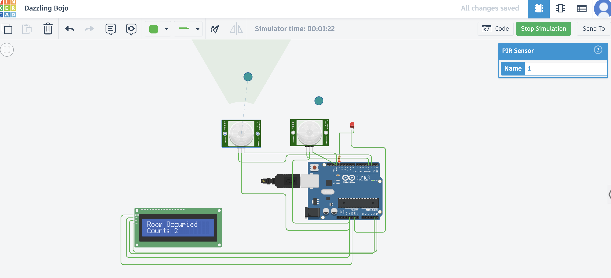

# 🚦 Office Occupancy-Based Lighting System

An Arduino project that automates room lighting based on real-time occupancy detection using PIR sensors and I2C LCD. Built to simulate smart energy-saving systems.

## 🛠️ Components Used
- Arduino Uno
- 2 x PIR Sensors (Entry & Exit)
- I2C 16x2 LCD Display
- 1 x LED (Simulates room light)
- 220Ω Resistor
- Jumper wires, Breadboard

## 🔌 Circuit Overview

| Component  | Arduino Pin |
|------------|--------------|
| PIR Entry  | D2           |
| PIR Exit   | D3           |
| LED        | D13 (via 220Ω) |
| LCD SDA    | A4           |
| LCD SCL    | A5           |
| LCD VCC    | 5V           |
| LCD GND    | GND          |

## 🧠 Logic
- Motion at entry PIR → `count++`
- Motion at exit PIR → `count--`
- If count > 0 → LED ON & LCD shows occupancy
- If count = 0 → LED OFF & LCD shows “Room Empty”

## 💡 Features
- Live room occupancy tracking
- Automated lighting control
- LCD status display
- Energy-efficient simulation

## 📸 Screenshot

## 📈 Future Scope
- Add buzzer alerts
- Add LDR for light-based auto mode
- Connect with Wi-Fi module (e.g., ESP8266) for IoT version
